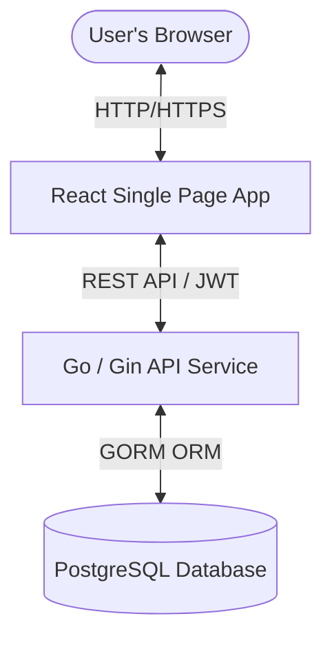

# TrackFlow: Modern Expense & Income Tracker

TrackFlow is a responsive, full-stack expense tracker application created with React & Go. It enables users to register, sign in, manage transactions (incomes and expenses), and filter records dynamically by categories or date ranges.

---

## 🏗️ Architecture Overview

The system follows a decoupling model separating the frontend client, Go REST API, and PostgreSQL database.



---

## 🛠️ Technology Stack

| Layer                | Technologies                                          |
| :------------------- | :---------------------------------------------------- |
| **Frontend**         | React 19, TypeScript, Vite, Vanilla CSS, Lucide React |
| **Backend**          | Go (Golang), Gin Gonic, GORM, Bcrypt (Auth), JWT      |
| **Database**         | PostgreSQL 16                                         |
| **Containerization** | Docker, Docker Compose                                |

---

## 📁 Repository Structure

```text
expense-tracker/
├── backend/                   # Go REST API Service
│   ├── config/                # Database connection configuration
│   ├── controllers/           # Auth and Transaction controller handlers
│   ├── middleware/            # JWT and CORS Middlewares
│   ├── models/                # GORM schemas (User, Transaction)
│   ├── routes/                # Gin Router setup
│   ├── main.go                # Application entrypoint
│   └── Dockerfile             # Multi-stage production docker build
├── frontend/                  # React Single Page Application (SPA)
│   ├── src/
│   │   ├── components/        # UI components (FilterBar, TransactionList, form contexts)
│   │   ├── context/           # App state (AuthContext, ExpenseContext)
│   │   ├── services/          # API services & constants
│   │   ├── types/             # TypeScript interfaces
│   │   ├── App.tsx            # Main layout and route controller
│   │   └── index.css          # Core CSS variables and animations
│   ├── package.json
│   └── vite.config.ts
├── docker-compose.yml         # Containerized services orchestrator
└── .env                       # Environment credentials configuration template
```

---

## 🔑 Environment Configuration

Create a `.env` file at the root directory with the following variables:

```ini
DB_HOST=localhost
DB_PORT=5432
DB_USER=postgres
DB_PASSWORD=postgres
DB_NAME=expense_tracker
DB_SSLMODE=disable
JWT_SECRET=supersecretkey
```

---

## 🚀 Setup & Execution

### Option A: Running with Docker Compose (Recommended)

To run the database and Go backend in containers:

1. Build and run the containers:
   ```bash
   docker-compose up --build
   ```
2. Run the frontend locally (from the `frontend` directory):
   ```bash
   cd frontend
   npm install
   npm run dev
   ```

### Option B: Local Manual Setup

#### 1. Database Setup

Ensure PostgreSQL is running and create a database named `expense_tracker`:

```sql
CREATE DATABASE expense_tracker;
```

#### 2. Backend Setup

Navigate to the `backend` directory, download dependencies, and start the API server:

```bash
cd backend
go mod download
go run main.go
```

The backend server runs on `http://localhost:8080`.

#### 3. Frontend Setup

Navigate to the `frontend` directory, install dependencies, and start the development server:

```bash
cd frontend
npm install
npm run dev
```

Open `http://localhost:5173` in your browser.

---

## 📑 API Endpoints Documentation

### Authentication Endpoints

#### Register User

- **URL:** `/api/auth/register`
- **Method:** `POST`
- **Request Body:**
  ```json
  { "email": "user@example.com", "password": "securepassword" }
  ```
- **Success Response (200 OK):**
  ```json
  { "message": "User registered successfully", "email": "user@example.com" }
  ```

#### Login User

- **URL:** `/api/auth/login`
- **Method:** `POST`
- **Request Body:**
  ```json
  { "email": "user@example.com", "password": "securepassword" }
  ```
- **Success Response (200 OK):**
  ```json
  { "token": "eyJhbGciOi...", "user": { "id": 1, "email": "user@example.com" } }
  ```

---

### Transactions Endpoints (Authenticated)

_Headers required:_ `Authorization: Bearer <your_jwt_token>`

#### Get All Transactions

- **URL:** `/api/transactions`
- **Method:** `GET`
- **Success Response (200 OK):**
  ```json
  [
    {
      "id": "uuid-v4-string",
      "user_id": 1,
      "type": "EXPENSE",
      "amount": 25.5,
      "category": "Food",
      "date": "2026-05-28T00:00:00Z",
      "note": "Lunch with team",
      "created_at": "2026-05-28T08:30:00Z",
      "updated_at": "2026-05-28T08:30:00Z"
    }
  ]
  ```

#### Create Transaction

- **URL:** `/api/transactions`
- **Method:** `POST`
- **Request Body:**
  ```json
  {
    "id": "uuid-v4-string",
    "type": "EXPENSE",
    "amount": 25.5,
    "category": "Food",
    "date": "2026-05-28T00:00:00Z",
    "note": "Lunch with team"
  }
  ```
- **Success Response (201 Created):**
  ```json
  {
    "id": "uuid-v4-string",
    "user_id": 1,
    "type": "EXPENSE",
    "amount": 25.5,
    "category": "Food",
    "date": "2026-05-28T00:00:00Z",
    "note": "Lunch with team"
  }
  ```

#### Delete Transaction

- **URL:** `/api/transactions/:id`
- **Method:** `DELETE`
- **Success Response (200 OK):**
  ```json
  { "message": "Transaction deleted successfully" }
  ```

---

## 🗄️ Database Schema

### Users Table

- `id` (Primary Key, Auto Increment)
- `email` (Unique Index, Not Null)
- `password` (Hashed using bcrypt, Not Null)
- `created_at` (Timestamp)
- `updated_at` (Timestamp)

### Transactions Table

- `id` (Primary Key, String UUID)
- `user_id` (Foreign Key -> Users.id, Indexed, Not Null)
- `type` (String: `INCOME` or `EXPENSE`, Not Null)
- `amount` (Decimal/Float, Not Null)
- `category` (String, Not Null)
- `date` (Timestamp, Not Null)
- `note` (String)
- `created_at` (Timestamp)
- `updated_at` (Timestamp)

---

## 📱 Mobile Responsiveness Features

The dashboard layout dynamically scales and adjusts for tablets and phones:

- **Form Columns Stack:** The category selection and date inputs in the `AddTransactionForm` stack vertically on screens under `576px` to prevent text overlap.
- **Filter Controls Flex:** The `FilterBar` control boxes wrap and stretch to full width on mobile screens, stacking date range pickers cleanly.
- **Mobile Touch Optimization:** Hover actions in the `TransactionList` are replaced with native touch-visible icons on viewports under `768px`, ensuring delete buttons are fully accessible on touch-based devices.
